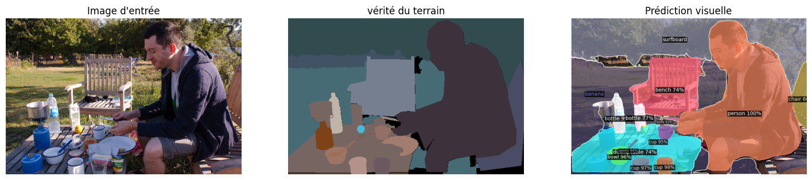
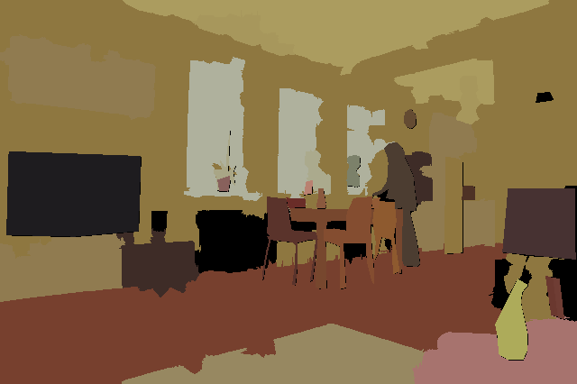
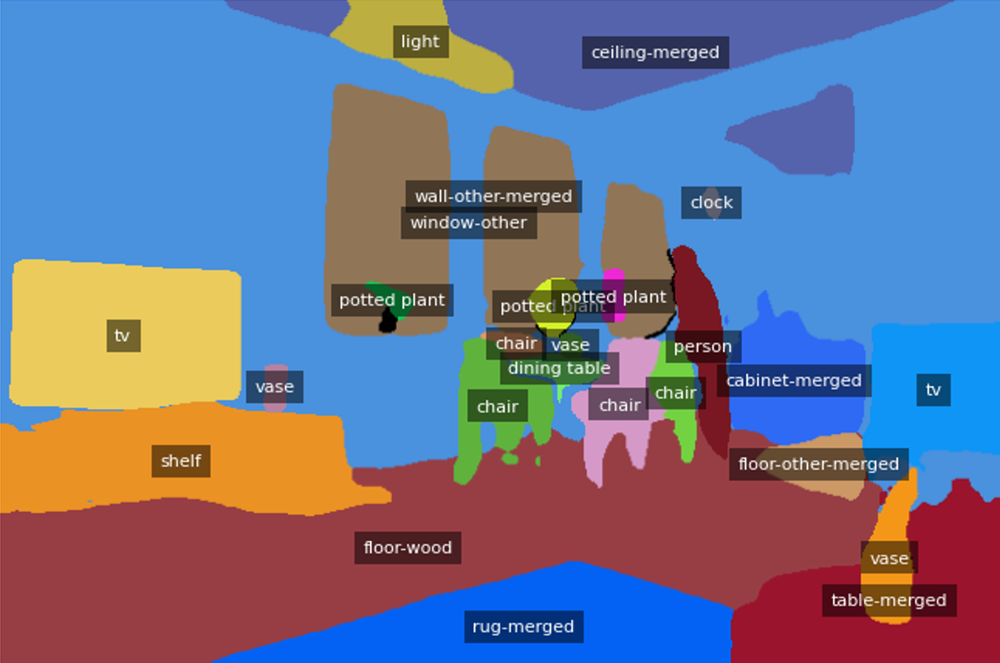

# Panoptic Segmentation with Detectron2 and Mask2Former

This project evaluates and compares two state-of-the-art models for **panoptic segmentation** on the **COCO 2017** dataset:
- [Panoptic-FPN](https://github.com/facebookresearch/detectron2)
- [Mask2Former](https://github.com/facebookresearch/Mask2Former)

---

##  Panoptic-FPN

We used the `Panoptic-FPN` model with a `ResNet-50` backbone.  
The model was loaded through **Detectron2** using the official configuration file:  
`panoptic_fpn_R_50_3x.yaml`.

###  Setup
- Framework: **Detectron2**
- Backbone: **ResNet-50**
- Dataset: **COCO 2017**
- Images tested: **500**

###  Example Output



###  Evaluation Metrics

| Category     | PQ (%) | SQ (%) | RQ (%) |
|--------------|--------|--------|--------|
| All          | 36.3   | 67.0   | 43.6   |
| Things       | 48.9   | 80.8   | 58.4   |
| Stuff        | 17.3   | 46.3   | 21.4   |

---

## Mask2Former

The `Mask2Former` model was used with a `Swin-Large` backbone.  
It directly predicts masks and class labels using a **pixel decoder + transformer decoder** with **masked attention**.

### Setup
- Model: `Mask2Former-Swin-Large`
- Parameters: ~210 million
- Weight size: ~800MB
- Framework: **Hugging Face + Google Colab**
- Dataset: **COCO 2017 (val2017 subset)**
- Images processed: **500**

### Example Outputs

<p align="center">
  
  
  
</p>

###  Evaluation Metrics

| Category     | PQ (%) | SQ (%) | RQ (%) |
|--------------|--------|--------|--------|
| All          | 52.4   | 80.9   | 63.0   |
| Things       | 58.3   | 82.1   | 69.6   |
| Stuff        | 43.7   | 79.2   | 53.1   |

---

## Conclusion

- **Mask2Former** significantly outperforms **Panoptic-FPN**, especially on "Stuff" categories.
- However, it requires **much more computational power** (model size + GPU).
- **Panoptic-FPN** remains a solid, fast alternative for lighter environments.

---

##  Requirements

- Python 3.8+
- PyTorch >= 1.10
- `detectron2`
- `transformers`, `datasets` (for Mask2Former)

---

##  Usage

Clone the repository:

```bash
git clone https://github.com/2ineddine/Panoptic-Segmentation.git

